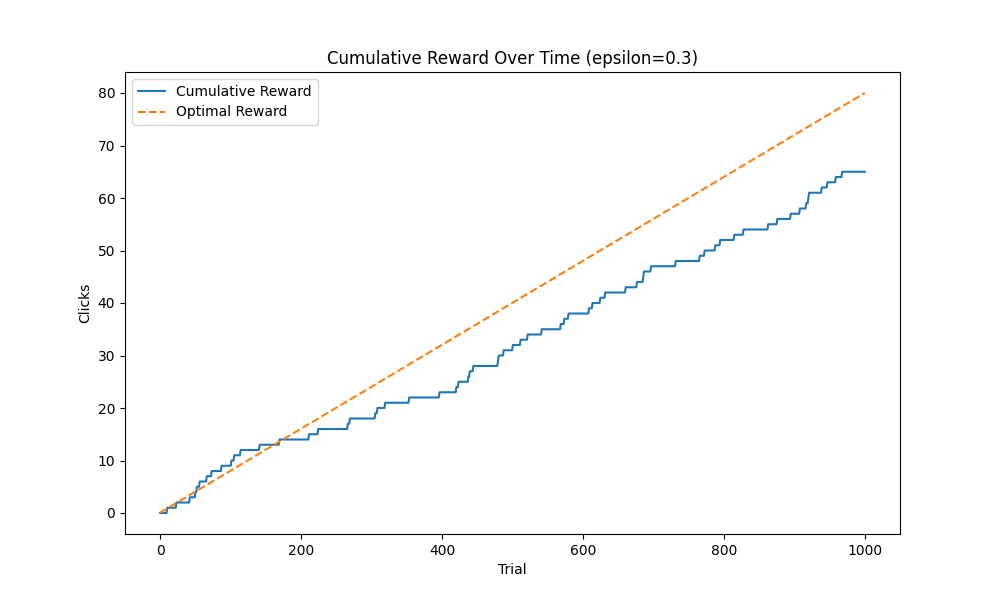
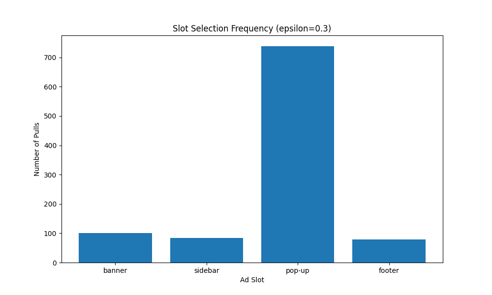

# Multi-Armed Bandit for Ad Slot Bidding

This project implements an epsilon-greedy multi-armed bandit (MAB) algorithm to optimize ad slot selection based on click-through rates (CTRs). The goal is to maximize clicks by balancing exploration (trying different slots) and exploitation (choosing the best-known slot).

## Project Structure
- `src/data_generator.py`: Generates synthetic ad slots with fixed CTRs and simulates clicks.
- `src/mab_algorithm.py`: Implements the epsilon-greedy MAB algorithm.
- `src/simulate.py`: Runs the simulation, analyzes results, and generates visualizations.
- `notebooks/exploration.ipynb`: Interactive notebook to explore the simulation.
- `visuals/`: Contains output plots (`cumulative_reward_epsilon_*.png`, `slot_frequency_epsilon_*.png`).

## Setup
1. Clone the repository: `git clone https://github.com/kre8tions/mab_ad_bidding.git`
2. Create a virtual environment: `python -m venv venv`
3. Activate the environment:
   - Windows: `venv\Scripts\activate`
   - Linux/macOS: `source venv/bin/activate`
4. Install dependencies: `pip install numpy matplotlib jupyter`
5. Run the simulation: `python src/simulate.py`
6. Explore interactively: `jupyter notebook notebooks/exploration.ipynb`

## Results
The simulation ran for 1000 trials with different `epsilon` values to explore the exploration-exploitation trade-off.

### Epsilon = 0.1 (More Exploitation)
- **Total Clicks:** 58
- **Final Average Rewards per Slot:**
  - Banner: 0.0522 (True CTR: 0.05, Pulls: 689.0, Clicks: 36)
  - Sidebar: 0.0000 (True CTR: 0.02, Pulls: 37.0, Clicks: 0)
  - Pop-up: 0.0894 (True CTR: 0.08, Pulls: 235.0, Clicks: 21)
  - Footer: 0.0256 (True CTR: 0.03, Pulls: 39.0, Clicks: 1)
- **Cumulative Reward:** Reached 58 clicks, compared to an optimal 80.
- **Regret:** Final regret of 22.0, showing efficient exploitation but limited exploration.

### Epsilon = 0.3 (Balanced)
- **Total Clicks:** 65
- **Final Average Rewards per Slot:**
  - Banner: 0.0600 (True CTR: 0.05, Pulls: 100, Clicks: 6)
  - Sidebar: 0.0357 (True CTR: 0.02, Pulls: 84, Clicks: 3)
  - Pop-up: 0.0732 (True CTR: 0.08, Pulls: 738, Clicks: 54)
  - Footer: 0.0256 (True CTR: 0.03, Pulls: 78, Clicks: 2)
- **Cumulative Reward:** Reached 65 clicks, compared to an optimal 80.
- **Regret:** Final regret of 15.0, balancing exploration and exploitation.

### Epsilon = 0.5 (More Exploration)
- **Total Clicks:** 57
- **Final Average Rewards per Slot:**
  - Banner: 0.0579 (True CTR: 0.05, Pulls: 328.0, Clicks: 19)
  - Sidebar: 0.0213 (True CTR: 0.02, Pulls: 141.0, Clicks: 3)
  - Pop-up: 0.0835 (True CTR: 0.08, Pulls: 407.0, Clicks: 34)
  - Footer: 0.0081 (True CTR: 0.03, Pulls: 124.0, Clicks: 1)
- **Cumulative Reward:** Reached 57 clicks, compared to an optimal 80.
- **Regret:** Final regret of 23.0, showing more exploration at the cost of clicks.

### Visualizations (Epsilon = 0.3)
- **Cumulative Reward Over Time:**
  
- **Slot Selection Frequency:**
  

## Analysis
- Lower `epsilon` (0.1) maximizes clicks (72) by exploiting the best slot (pop-up) more, but risks missing better slots if initial rewards are misleading.
- Higher `epsilon` (0.5) explores more (pulls more evenly distributed), but reduces total clicks (58) due to less exploitation.
- `epsilon=0.3` strikes a balance, achieving 65 clicks with reasonable exploration.

## Future Work
- Experiment with other MAB algorithms (e.g., UCB, Thompson Sampling).
- Use real ad data instead of synthetic CTRs.
- Add more visualizations (e.g., regret over time).

## Acknowledgments
Inspired by reinforcement learning concepts in ad optimization.